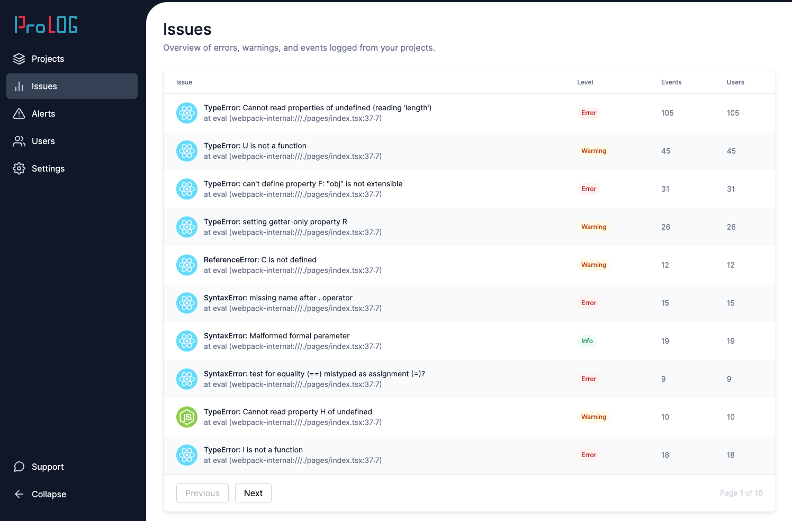

## The Application

This is a cloned repository of the [React Job Simulator](https://profy.dev) course. The starting codebase has been re-purposed as a showcase of QA automated testing alongside feature development.

The history of the project will show features and fixes implemented from tickets and designs and the tests to accompany those tasks.

The application mimicks an error logging and monitoring tool similar to Sentry or Rollbar.



## Getting Started

### 1. Clone & Install

This project is built with Next.js, TypeScript, Cypress & SCSS modules among others. To start working on the project, first clone the repository on your local machine and install the dependencies.

```bash
npm install
```

If these are any warnings or vulnerabilities we're going to have to start the `npm` dance with:

```bash
npm audit fix --force
...
npm install
```

After that, follow any errors and fix the errors by chagning the versions of packages in the `package.json` file. But! before manually playing with individual package versions try:

```bash
npm update
```

And then `npm install` shouldn't throw any errors. If it does, keep on keeping on with the npm dance we all love and care about.

### 2. Create .env File

**copy the `.env.template` file to a new file called `.env`.** This file contains the required environment variables that are injected by Next.js via the `dotenv` package.

### 3. Run Development Server

Finally, run the development server:

```bash
npm run dev
```

Now you can open [http://localhost:3000/dashboard](http://localhost:3000/dashboard) with your browser to see the application.

## Recommended VS Code Extensions

** Per the [React Job Simulator](https://profy.dev) recommendations **

This project uses tools like ESLint, Stylelint, and Prettier. To make the most of these tools it's recommended to install the corresponding extensions. For VS Code those are:

- [ESLint](https://marketplace.visualstudio.com/items?itemName=dbaeumer.vscode-eslint)
- [Stylelint](https://marketplace.visualstudio.com/items?itemName=stylelint.vscode-stylelint)
- [Prettier](https://marketplace.visualstudio.com/items?itemName=esbenp.prettier-vscode)
- [SCSS IntelliSense](https://marketplace.visualstudio.com/items?itemName=mrmlnc.vscode-scss) (e.g. for auto-completion of SCSS variables)
- [React CSS modules](https://marketplace.visualstudio.com/items?itemName=viijay-kr.react-ts-css) (e.g. to open the CSS class definition with CMD/Ctrl + click and warn about non-existent class names)

The official Stylelint extension might need some adjustment of your `settings.json` file. If it doesn't work out of the box try adding these lines:

```
"css.validate": false,
"less.validate": false,
"scss.validate": false,
"stylelint.validate": ["css", "scss"],
```

Additional extensions that I find very valuable are

[Code Spell Checker](https://marketplace.visualstudio.com/items?itemName=streetsidesoftware.code-spell-checker)
[GitLens](https://marketplace.visualstudio.com/items?itemName=eamodio.gitlens)
[SVG](https://marketplace.visualstudio.com/items?itemName=jock.svg)
[GitHub Copilot](https://marketplace.visualstudio.com/items?itemName=GitHub.copilot) (paid)

## Tests

### e2e

Tests with Cypress were part of the inherited baseline project.

Tests with Playwright are part of the new changes and additions.

Further tests with both, Cypress and Playwright, and later on with Selenium 4, will be added as part of development.

A sample screenshot of Cypress has been provided here:


## Storybook

Storybook is a great tool to document your components and visually test them in isolation. To open Storybook run

```bash
npm run storybook
```
